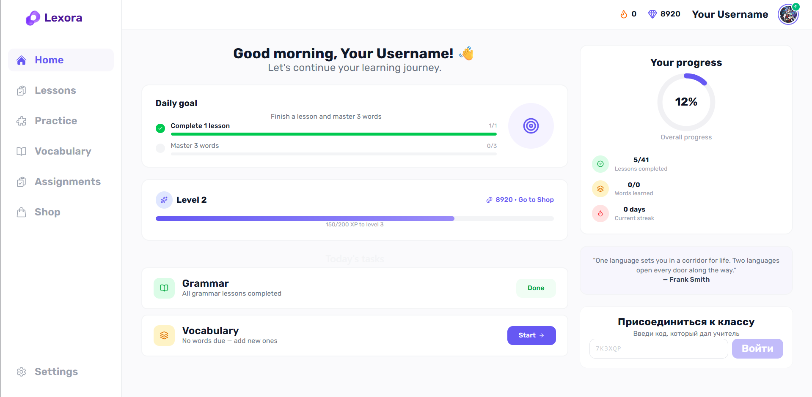
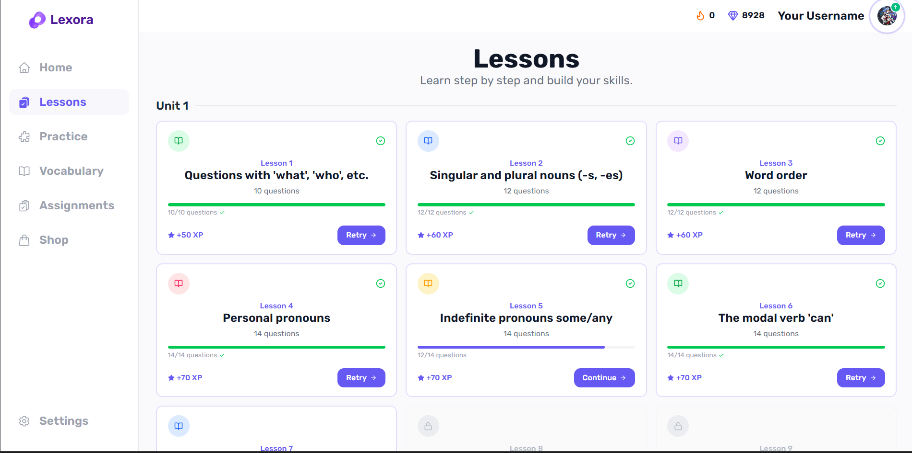
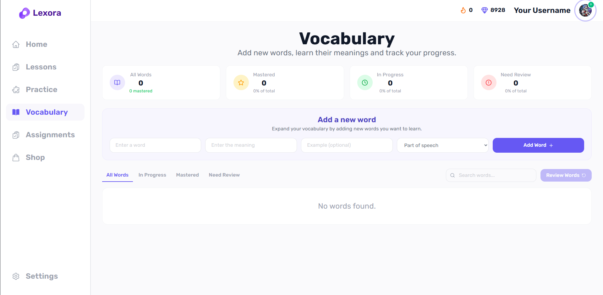
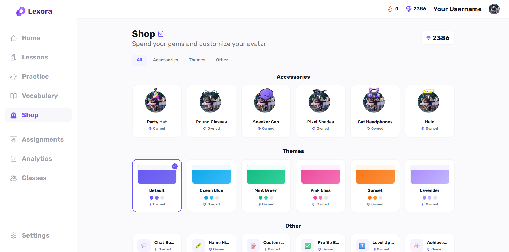

<h1 align="center">
LEXORA
</h1>

<b>Interactive English Learning Platform</b>

---

# 🇬🇧 English

## 📖 About the Project

LEXORA is a modern educational platform designed to make English learning more interactive, engaging and accessible.

The platform provides students with structured lessons, vocabulary training, reading exercises and quizzes while allowing teachers to manage learning activities and monitor student progress.

The project combines modern frontend technologies with a gamification system to create a motivating learning experience.

---

# ✨ Features

## 👨‍🎓 Student Features

- 📚 Interactive English lessons
- 📝 Grammar practice
- 🔤 Vocabulary training
- 📖 Reading exercises
- ✅ Interactive quizzes with instant feedback
- ⭐ XP reward system
- 🪙 Virtual currency and rewards
- 👤 Avatar customization
- 🛒 In-app shop
- 📊 Personal learning progress tracking
- 🔐 Authentication and user profiles

## 👨‍🏫 Teacher Features

- 👥 Student management
- 📊 Student progress monitoring
- 📚 Learning content management
- 📝 Assignment and exercise management
- 📈 Learning analytics
- 🎯 Tools for tracking student performance

---

# 🛠 Technologies

## Frontend

- React
- Vite
- Tailwind CSS
- React Router
- Framer Motion
- Lucide React

## Backend

- Supabase
- PostgreSQL

## Deployment

- Netlify

---

# 🎨 Screenshots

## 🏠 Student Dashboard

Main student interface with lessons, XP, progress statistics and learning activities.

## 📚 Lesson Page

Interactive lesson page with theory, exercises and quizzes.

## 🔤 Vocabulary Practice

Vocabulary learning interface with words, translations and exercises.

## 🛒 Avatar Shop

Gamification system with rewards, customization items and virtual currency.

---

# 🌐 Live Demo

The application is available online:

**https://lexora-edu.netlify.app/**

---

# 🔒 Repository Purpose

This repository contains the source code of LEXORA for educational, portfolio and demonstration purposes.

The project is not intended for redistribution, commercial reuse or copying without permission.

---

# 🚀 Development

The project was built using modern web development practices, including:

- Component-based architecture
- Reusable React components
- Client-side routing
- Database integration
- Authentication system
- Responsive design

---

# 🔮 Future Improvements

- 🎤 Speaking practice
- 🤖 AI-powered English ChatBot
- 📱 Mobile application
- 🌍 More learning levels
- 📚 Additional teacher tools

---

# 👨‍💻 Author

Created by **Alim Sheikhmambetov**

---

# 🇷🇺 Русский

<h1 align="center">
LEXORA
</h1>

<b>Интерактивная платформа для изучения английского языка</b>

## 📖 О проекте

LEXORA — это современная образовательная платформа для изучения английского языка, созданная для объединения учеников и преподавателей через интерактивные инструменты обучения.

Платформа помогает ученикам изучать английский язык через структурированные уроки, практику грамматики, изучение слов, задания на чтение и интерактивные тесты.

Также LEXORA предоставляет преподавателям инструменты для управления учебным процессом, создания заданий и отслеживания прогресса учеников.

---

# ✨ Возможности

## 👨‍🎓 Возможности для учеников

- 📚 Интерактивные уроки английского языка
- 📝 Практика грамматики
- 🔤 Изучение словарного запаса
- 📖 Упражнения на чтение
- ✅ Интерактивные тесты с мгновенной проверкой
- ⭐ Система опыта (XP)
- 🪙 Виртуальная валюта и награды
- 👤 Кастомизация аватара
- 🛒 Внутриигровой магазин
- 📊 Отслеживание личного прогресса
- 🔐 Регистрация и профили пользователей

## 👨‍🏫 Возможности для преподавателей

- 👥 Управление учениками
- 📊 Отслеживание прогресса студентов
- 📚 Управление учебными материалами
- 📝 Создание заданий и упражнений
- 📈 Аналитика обучения
- 🎯 Инструменты контроля успеваемости

---

# 🛠 Использованные технологии

## Frontend

- React
- Vite
- Tailwind CSS
- React Router
- Framer Motion
- Lucide React

## Backend

- Supabase
- PostgreSQL

## Развертывание

- Netlify

---

# 🌐 Демо

Приложение доступно онлайн:

**https://lexora-edu.netlify.app/**

---

# 🔒 Назначение репозитория

Этот репозиторий содержит исходный код LEXORA для демонстрации проекта, портфолио и образовательных целей.
